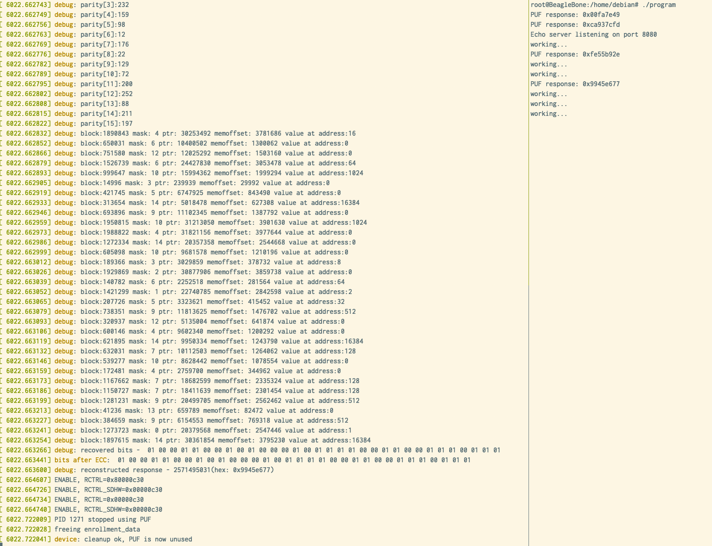
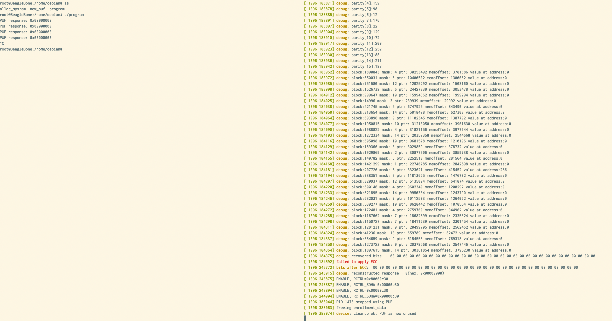

# puf-software-protection


## How to use this repository

### Pre-requisites
- [Docker Desktop](https://www.docker.com/products/docker-desktop/) installed. (NOTE docker desktop is needed as the docker image used by arch_emulator uses a different architecture that needs to be emulated).
- LLVM installed and updated llvm-passes/CMakeLists.txt [How-to](./llvm-passes/README.md).
- Update the `LLVM_OPT` in the [Makefile](./Makefile) to point to the `opt` of the instalation path of LLVM.
- Rust,Cargo installed.
- Cmake installed.

### Run

This repository is setup such that it will produce a protected binary with an already existing pre-configuration that I've used
while testing.

Simply run.

1.
```bash
$ make
```

2.
```bash
$ make patch
```

This will produce a protected binary, without actually needing the Beagle Bone Black rec 3C board, in the path `arch_emulator/volume/example/target/release/deps/program`.

The following two pictures are from two devices, one for which the program was enrolled for and the other where the same program fails.





## Repository structure

### Arch emulator
This sub folder contains the necessary steps to spin up a docker container for cross compilation for armv7, which the Beagle Bone Black uses.

### Elf Parser
[Read more](./elf-parser/README.md)

This sub folder includes a utility command line app that

1. (elf-parser read) parsers the .TEXT segment of the compiled Elf binary and outputs some data about the functions, like the offset, size name...
2. (elf-parser patch) patches the .TEXT segment by looking for "MARKERS" which will be replaced to make hash function hash to 0.
3. (elf-parser patch) patches the .TEXT segment by looking for "MARKERS" to patch the bounds of the checksumming functions.
3. (elf-parser patch) patches the .TEXT segment by looking for "MARKERS" to patch the reference values used to compute function addresses.

### Enrollments
[Read more](./enrollments/README.md)

This sub folder contains scripts and command line tools to work with the enrollments of DRAM cells.

1. You would use enrollments/scripts/enroll.sh to enroll the DRAM region for the PUF.
2. You would use enrollments/enroll with the combination of a JSON config file (an example is given in ./enrollments/bbb_config.json) to enroll cells for the PUF.

### Kmod
[Read more](./kmod/README.md)

This sub folder is for the used Linux kernel modules

1. Alloc Sysram module would be use to isolate a memory region for the PUF such that it will not be used by the OS.
2. Plain Puf module would be used for the enrollments of the DRAM cells within the isolated memory region.
3. PUF module would be used for programs that were patched with the LLVM pass to query the PUF.

### LLVM Passes
[Read more](./llvm-passes/README.md)

This sub folder contains an LLVM out of tree patch the patches the generate LLVM IR to make use of the PUF, including checksumming.

## Your own enrollments
!IMPORTANT

Make sure you are running the `am335x-eMMC-flasher-debian-11.7-iot-armhf-2023-09-02-4gb` image accessible from https://www.beagleboard.org/distros
Which at the time of writing this was the lastest image. Never images can use never compiles which may optimize some of the instructions from the kernel modules, leading
to a not working example.

To make your own enrollments You would do these steps in order.

1. SCP the `alloc_sysram` and `plain_puf` into your Beagle Bone Black device to `/home/debian/`
2. Make sure you have root access to the Beagle Bone black via SSH without requiring a password (i.e passwordless ssh connection establishment). You could use something like `ssh-copy-id root@beaglebone.local`
3. You would Build the `alloc_sysram` and `plain_puf` modules and load the `alloc_sysram` module by using `insmod alloc_sysram.ko alloc_size_1=4194304` (This would allocate 4MB of memory)
4. You will copy the start address of the allocated memory. (You can view it by typing `dmesg` on the Beagle Bone)
5. You would set the address and size in the ./enrollments/scripts/enroll.sh script and then run it to enroll the cells.
5. After the enrollments make sure you move all of them into a single directory. (This repository expects you put it in the `./enrollments/enroll_BBB` directory`
6. After that you would adjust the `./enrollments/bbb_config.json` based on the enrollments you did and run `make` at the root directory of this project.
7. You would then run `make patch`.
8. You would deploy the `kmod/puf` kernel module and run it on the Beagle Bone, be sure to set the correct params `insmod dram_puf.ko puf_phys_addr=0x<addres-from-dmesg> puf_size=<puf-size>`
9. You would SCP the patched program located in `./arch_emulator/volume/example/target/release/deps/program` to your Beagle Bone.
10. Run the program.
